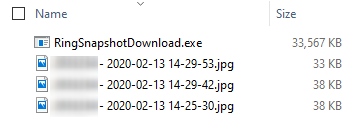

[![licence badge]][licence]
[![stars badge]][stars]
[![forks badge]][forks]
[![issues badge]][issues]

[licence badge]:https://img.shields.io/badge/license-Apache2-blue.svg
[stars badge]:https://img.shields.io/github/stars/koenzomers/RingSnapshotDownload.svg
[forks badge]:https://img.shields.io/github/forks/koenzomers/RingSnapshotDownload.svg
[issues badge]:https://img.shields.io/github/issues/koenzomers/RingSnapshotDownload.svg

[licence]:https://github.com/koenzomers/RingSnapshotDownload/blob/master/LICENSE.md
[stars]:https://github.com/koenzomers/RingSnapshotDownload/stargazers
[forks]:https://github.com/koenzomers/RingSnapshotDownload/network
[issues]:https://github.com/koenzomers/RingSnapshotDownload/issues

# Ring Snapshot Download Tool
Console application written in .NET Core 3.1 compiled for Windows, Raspberry Pi, Linux and macOS which allows for downloading of Ring snapshots to your local machine. It is just a sample console application wrapper around the [Ring API I have written](https://github.com/KoenZomers/RingApi).

## Version History

1.0.0.1 - February 14, 2020

- Ring 2 doorbells will now also be returned when doing a `-list`

1.0.0.0 - February 13, 2020

- Initial version

## System Requirements

- Either of: Windows x86, Windows x64, Windows ARM (i.e. Windows 10 IoT), Linux ARM (i.e. Raspberry Pi), Linux x64 (any Linux based distribution), Mac OS (Apple devices)
- For all platforms the application is self containing, so it does not need anything else to be installed on the operating system, not even .NET Core

## Usage Instructions

1. Download the ZIP file of the latest version from [releases](https://github.com/KoenZomers/RingSnapshotDownload/releases). Make sure you download the right type for the platform on which you want to run it:
   - Windows 7 SP1 or later, Windows 8.1, Windows 10 version 1607 or later, Windows Server 2012 R2 or later: win-x86.zip
   - Linux ARM (i.e. Raspberry Pi): linux-arm.zip
   - Linux x64 (any Linux based distribution): linux-x64.zip
   - Mac OSX (Apple devices): osx-x64.zip
   - Windows 10 IoT: win-arm.zip
2. Extract it to any location on your machine
3. Run RingSnapshotDownload.exe in a Command Prompt or PowerShell window to see the possible parameters and samples

If you want to run this application unattended in i.e. a scheduled daily download script, ensure you run it once manually with your username and password. After this run it will store the refresh token and will run without needing a username, password or two factor authentication token on subsequent runs.

## Current functionality

With this tool in its current state you can:

- Log on once to a two factor authentication enabled Ring account and then have it use the retrieved refresh token to run unattended on subsequent runs
- Download the latest snapshot from your Ring device
- List all Ring doorbells and Ring stickupcams you have available under your Ring account
- Force the Ring device to capture a fresh snapshot

## Feedback

Any kind of feedback is welcome! Feel free to drop me an e-mail at koen@zomers.eu or [create an issue](https://github.com/KoenZomers/RingSnapshotDownload/issues).
